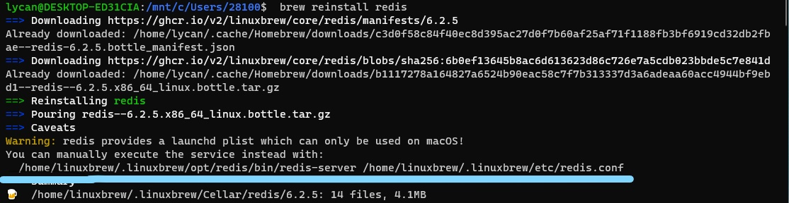

# WSL

## 适用于 Linux 的 Windows 子系统文档

### 步骤1 为 Windows 启用 Linux 子系统

在Windows上安装任何Linux发行版之前，你必须首先启用 "Windows Subsystem for Linux "的可选功能。

以管理员身份打开PowerShell并运行:

```powershell
dism.exe /online /enable-feature /featurename:Microsoft-Windows-Subsystem-Linux /all /norestart
```

建议现在进入第2步，更新到WSL 2，但如果你希望只安装WSL 1，你现在可以**重启**你的机器，然后进入第6步 安装你选择的Linux发行版。要更新到WSL 2，**等待重新启动**你的机器，然后进入下一个步骤。

### 步骤2 检查运行WSL 2的要求

要更新到WSL 2，你必须运行Windows 10。

- 对于x64系统。**版本1903**或更高，**Build 18362**或更高。
- 对于ARM64系统。**版本2004**或更高，**Build 19041**或更高。
- 低于18362的构建版本不支持WSL 2。使用[Windows Update Assistant](https://www.microsoft.com/software-download/windows10)来更新您的Windows版本。

要检查你的版本和构建号，选择**Windows标志键+R**，输入**winver**，选择**OK**。在设置菜单中[更新到最新的Windows版本]（ms-settings:windowsupdate）。

> [！注意]
> 如果你运行的是Windows 10的1903或1909版本，从你的Windows菜单中打开 "设置"，导航到 "更新和安全 "并选择 "检查更新"。你的构建号必须是18362.1049+或18363.1049+，小构建号超过.1049。阅读更多。[WSL 2支持即将进入Windows 10版本1903和1909]（https://devblogs.microsoft.com/commandline/wsl-2-support-is-coming-to-windows-10-versions-1903-and-1909/）。参见[故障排除说明](./troubleshooting.md#im-on-windows-10-version-1903-and-i-still-do-not-se-options-for-wsl-2)。

### 步骤3 启用虚拟机功能

在安装WSL 2之前，你必须启用**虚拟机平台**的可选功能。你的机器将需要[虚拟化功能](./troubleshooting.md#error-0x80370102-thevirtual-machine-could-not-be-started-becaus-a-requireive-feature-is-installed)来使用这一功能。

以管理员身份打开PowerShell并运行:

```powershell
dism.exe /online /enable-feature /featurename:VirtualMachinePlatform /all /norestart
```

**重新启动**你的机器，完成WSL的安装并更新到WSL 2。

### 步骤4 下载Linux内核更新包

1. 下载最新的软件包。
    - [WSL2 Linux kernel update package for x64 machines](https://wslstorestorage.blob.core.windows.net/wslblob/wsl_update_x64.msi)

    > [！注意]
    > 如果你使用的是ARM64机器，请下载[ARM64软件包](https://wslstorestorage.blob.core.windows.net/wslblob/wsl_update_arm64.msi)代替。如果你不确定你的机器是什么类型的，请打开Command Prompt或PowerShell并输入。`systeminfo | find "System Type"`。**注意事项：**在非英语的Windows版本上，你可能需要修改搜索文本，例如，德语的搜索文本是`systeminfo | find "Systemtyp"`。

2. 运行上一步下载的更新包。(双击运行--会提示你提升权限，选择 "是 "来批准这个安装。)

一旦安装完成，进入下一步--在安装新的Linux发行版时，将WSL 2设置为你的默认版本。(如果你希望你的新Linux安装设置为WSL 1，请跳过此步骤）。)

> [！注意]
> 更多信息，请阅读文章[更新WSL2 Linux内核的变化](https://devblogs.microsoft.com/commandline/wsl2-will-be-generally-available-in-windows-10-version-2004)，可在[Windows命令行博客](https://aka.ms/cliblog)找到。

### 步骤5 将WSL2设置为你的默认版本

打开PowerShell，运行这个命令，在安装新的Linux发行版时将WSL 2设置为默认版本。

```powershell
wsl --set-default-version 2
```

### 步骤6 安装你选择的Linux发行版

1. 打开[Microsoft Store](https://aka.ms/wslstore)，选择你喜欢的Linux发行版。

    

    以下链接将打开每个发行版的微软商店页面。

    - [Ubuntu 18.04 LTS](https://www.microsoft.com/store/apps/9N9TNGVNDL3Q)
    - [Ubuntu 20.04 LTS](https://www.microsoft.com/store/apps/9n6svws3rx71)
    - [openSUSE Leap 15.1](https://www.microsoft.com/store/apps/9NJFZK00FGKV)
    - [SUSE Linux Enterprise Server 12 SP5](https://www.microsoft.com/store/apps/9MZ3D1TRP8T1)
    - [SUSE Linux Enterprise Server 15 SP1](https://www.microsoft.com/store/apps/9PN498VPMF3Z)
    - [Kali Linux](https://www.microsoft.com/store/apps/9PKR34TNCV07)
    - [Debian GNU/Linux](https://www.microsoft.com/store/apps/9MSVKQC78PK6)
    - [Fedora Remix for WSL](https://www.microsoft.com/store/apps/9n6gdm4k2hnc)
    - [Pengwin](https://www.microsoft.com/store/apps/9NV1GV1PXZ6P)
    - [Pengwin Enterprise](https://www.microsoft.com/store/apps/9N8LP0X93VCP)
    - [Alpine WSL](https://www.microsoft.com/store/apps/9p804crf0395)

2. 在发行版的页面上，选择 "获取"。

    

第一次启动新安装的Linux发行版时，会打开一个控制台窗口，你会被要求等待一两分钟，让文件解压缩并存储在你的电脑上。以后所有的启动都应该在一秒钟内完成。

然后你将需要[为你的新Linux发行版创建一个用户账户和密码](./user-support.md)。


**恭喜你! 你已经成功地安装并设置了一个与你的Windows操作系统完全集成的Linux发行版！**。

## 安装Windows终端

Windows终端可以实现多个标签（在多个Linux命令行、Windows命令提示符、PowerShell、Azure CLI等之间快速切换），创建自定义键绑定（打开或关闭标签的快捷键、复制+粘贴等），使用搜索功能，以及自定义主题（颜色方案、字体样式和大小、背景图像/模糊/透明）。[了解更多。](/windows/terminal)

[安装Windows终端](/windows/terminal/get-started)。

  

### 将你的发行版本设置为WSL 1或WSL 2

你可以通过打开PowerShell命令行并输入命令（仅在[Windows Build 18362或更高版本](ms-settings:windowsupdate)中可用）来检查分配给你所安装的每个Linux发行版的WSL版本。`wsl -l -v

```powershell
wsl --list --verbose
```

要设置一个发行版由WSL的任一版本支持，请运行。

```powershell
wsl --set-version <distribution name> <versionNumber>（设置版本）。
```

请确保将`<发行版名称>`替换为你的发行版的实际名称，`<版本号>`替换为数字'1'或'2'。你可以在任何时候通过运行与上面相同的命令，将 "2 "替换为 "1"，来改回WSL 1。

> [！注意]
> 从WSL 1到WSL 2的更新可能需要几分钟的时间才能完成，这取决于你的目标分布的大小。如果你正在运行来自Windows 10周年更新或创意者更新的WSL 1的旧（传统）安装，你可能会遇到一个更新错误。请按照这些说明来[卸载和删除任何遗留发行版](./install-legacy.md#uninstallingremoving-the-legacy-distro)。
>
> 如果`wsl --set-default-version`的结果是一个无效的命令，输入`wsl --help`。如果`--set-default-version`没有被列出，这意味着你的操作系统不支持它，你需要更新到1903版本，Build 18362或更高。如果你的操作系统是Build 19041 for ARM64，在使用PowerShell时，这个命令可能会失败，在这种情况下，你可以使用*Command Prompt*来代替发出``wsl.exe`命令。
>
> 如果你在运行该命令后看到这个信息。`WSL 2需要对其内核组件进行更新。有关信息请访问https://aka.ms/wsl2kernel`。你仍然需要安装MSI Linux内核更新包。

此外，如果你想让WSL 2成为你的默认架构，你可以用这个命令来实现。

```powershell
wsl --set-default-version 2
```

这将把任何新安装的发行版的版本设置为WSL 2。

## 安装Homebrew

### 快速安装

```js
/bin/bash -c "$(curl -fsSL https://cdn.jsdelivr.net/gh/ineo6/homebrew-install/install.sh)"
```

将以上命令粘贴至终端。脚本内置 中科大镜像 ，所以能让Homebrew安装的更快。

### 安装相关包

```brew
brew install node
brew install yarn
brew install mysql
brew install redis
```

### mysql启动

```brew
mysql.server start
```

### redis启动

可根据安装完成后的提示手动启动redis



## 参考链接
-  [Windows Subsystem for Linux Documentation](https://docs.microsoft.com/en-us/windows/wsl/)
-  [Windows Subsystem for Linux Installation Guide for Windows 10](https://docs.microsoft.com/en-us/windows/wsl/install-win10)
-  [mac下镜像飞速安装Homebrew教程](https://zhuanlan.zhihu.com/p/90508170)
-  [Homebrew 安装](https://brew.idayer.com/)
-  [Homebrew 官网](https://brew.sh/index_zh-cn)
